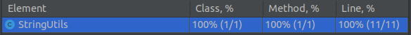
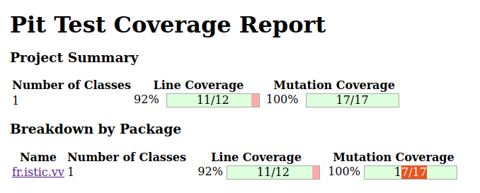

# Balanced strings

A string containing grouping symbols `{}[]()` is said to be balanced if every open symbol `{[(` has a matching closed symbol `]}` and the substrings before, after and between each pair of symbols is also balanced. The empty string is considered as balanced.

For example: `{[][]}({})` is balanced, while `][`, `([)]`, `{`, `{(}{}` are not.

Implement the following method:

```java
public static boolean isBalanced(String str) {
        // Create an empty stack
        Stack<Character> stack = new Stack<Character>();

        // Loop through each character in the input string
        for (char c : str.toCharArray()) {
            // If the character is an opening symbol, push it onto the stack
            if (c == '{' || c == '[' || c == '(') {
                stack.push(c);
            }
            // If the character is a closing symbol, pop the top symbol from the stack
            // and check if it matches the closing symbol
            else if (c == '}' || c == ']' || c == ')') {
                if (stack.isEmpty()) {
                    return false;
                }
                char top = stack.pop();
                if ((c == '}' && top != '{') || (c == ']' && top != '[') || (c == ')' && top != '(')) {
                    return false;
                }
            }
        }

        // If the stack is empty, the string is balanced
        return stack.isEmpty();
        }
```

`isBalanced` returns `true` if `str` is balanced according to the rules explained above. Otherwise, it returns `false`.

Use the coverage criteria studied in classes as follows:

1. Use input space partitioning to design an initial set of inputs. Explain below the characteristics and partition blocks you identified.
2. Evaluate the statement coverage of the test cases designed in the previous step. If needed, add new test cases to increase the coverage. Describe below what you did in this step.
3. If you have in your code any predicate that uses more than two boolean operators check if the test cases written so far satisfy *Base Choice Coverage*. If needed add new test cases. Describe below how you evaluated the logic coverage and the new test cases you added.
4. Use PIT to evaluate the test suite you have so far. Describe below the mutation score and the live mutants. Add new test cases or refactor the existing ones to achieve a high mutation score.

Write below the actions you took on each step and the results you obtained.
Use the project in [tp3-balanced-strings](../code/tp3-balanced-strings) to complete this exercise.

## Answer
1.
- La string est vide : ""
- IsBallanced est vrai : 
  - "()", "[]", "{}"
  - "[()]", "[[]]", "{[]}"
  - "{[][]}({})"
- IsBallenced est faux : 
  - "(", ")", "[", "}"
  - "][", ")(", "}{"
  - "([)]"

2. Il y a 100% de coverage 


3. Les tests écrit sont suffisants, il n'y a aps besoin d'écrire de nouveaux tests. 
4. 
